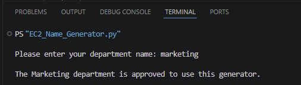
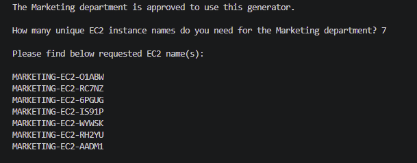
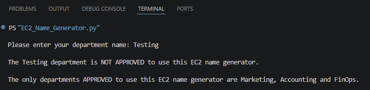

# EC2 NameForge: A Python-Based EC2 Name Generator 🐍☁️


## 🌎 Project Overview

EC2 NameForge is a beginner-friendly Python project that generates unique EC2 instance names for approved departments using a shared AWS environment.

The project is based on a cloud operations scenario where multiple departments use the same AWS account or environment. To keep EC2 instances easy to identify, each generated name includes the department name, an EC2 label, and a random set of letters and numbers.

Example:

```
MARKETING-EC2-A7K92
ACCOUNTING-EC2-M9X4Q
FINOPS-EC2-B3L8Z
````

This project helped me practice Python fundamentals while connecting the code to a realistic AWS naming use case.

## 🧩 Problem Statement

Several departments share an AWS environment. Without a consistent naming process, EC2 instances can become difficult to track, identify, or assign to the correct team.

The goal of this project was to create a Python script that:

1. Allows a user to enter their department name.
2. Checks whether that department is approved to use the generator.
3. Allows approved users to enter how many EC2 names they need.
4. Generates the requested number of unique EC2 instance names.
5. Adds random letters and numbers to each name.
6. Blocks unapproved departments from using the generator.

## ✅ Approved Departments

Only the following departments are approved to use this EC2 name generator:

```text
Marketing
Accounting
FinOps
```

The script also accounts for uppercase and lowercase variations. For example, the user can enter:

```text
marketing
Marketing
MARKETING
```

The program still recognizes the department as approved.

## ✨ Features

* Accepts user input for department name.
* Normalizes department input using `.lower()`.
* Validates the department against an approved department list.
* Blocks unapproved departments from generating EC2 names.
* Asks approved users how many EC2 names they need.
* Generates the requested number of EC2 names.
* Adds a random 5-character ending to each EC2 name.
* Uses uppercase formatting for the final EC2 name output.
* Includes helpful user messages and readable output spacing.
* Uses comments throughout the code to explain the logic.

## 🛠️ Technologies Used

* Python
* Python `random` library
* GitHub
* Markdown
* Visual Studio Code or any Python-friendly editor

## 📁 Repo Structure

```
ec2-nameforge-python/
│
├── README.md
├── src/
│   └── ec2_name_generator.py
│
├── screenshots/
│   ├── Py01 HeroImage.png
│   ├── approved-department-output.png
│   ├── generated-ec2-names-output.png
│   └── unapproved-department-output.png
│
├── docs/
│   └── project-reflection.md
│
├── .gitignore
└── LICENSE
```

## 🧠 How the Script Works

The script starts by defining the approved departments:

```python
allowed_departments = ["marketing", "accounting", "finops"]
```

The user is then asked to enter their department name:

```python
department = input("Please enter your department name: ")
```

The department input is converted to lowercase:

```python
department = department.lower()
```

This allows the script to handle different capitalization styles without needing to manually check every possible version.

The script then checks whether the department is approved:

```python
if department in allowed_departments:
```

If the department is approved, the user is asked how many EC2 instance names they need:

```python
number_of_instances = int(input(f"How many unique EC2 instance names do you need for the {department.capitalize()} department? "))
```

Then the script creates a pool of uppercase letters and numbers:

```python
characters = "ABCDEFGHIJKLMNOPQRSTUVWXYZ0123456789"
```

The script uses a loop to generate the number of EC2 names requested by the user:

```python
for instance in range(number_of_instances):
```

Inside that loop, another loop runs 5 times to build the random part of each EC2 name:

```python
random_part = ""

for i in range(5):
    random_part = random_part + random.choice(characters)
```

Finally, the completed EC2 name is printed:

```python
print(f"{department.upper()}-EC2-{random_part}")
```

## 🔁 Understanding the Nested Loops

One of the biggest learning moments in this project was understanding how the nested loops work.

The outer loop controls how many EC2 names are generated:

```python
for instance in range(number_of_instances):
```

The inner loop controls how many random characters are added to each EC2 name:

```python
for i in range(5):
```

In plain English:

```text
For each EC2 name requested:
    Start with an empty random ending.
    Pick 5 random characters.
    Add those characters to the EC2 name.
    Print the completed name.
```

This helped me understand how two loops can work together while still having different jobs.

## ▶️ How to Run It

1. Clone this repository:

```bash
git clone https://github.com/mrscee/ec2-nameforge-python.git
```

2. Navigate into the project folder:

```bash
cd ec2-nameforge-python
```

3. Run the Python script:

```bash
python src/ec2_name_generator.py
```

Depending on your system, you may need to use:

```bash
python3 src/ec2_name_generator.py
```

## 🖥️ Sample Output

### Approved Department

```text
Please enter your department name: marketing

The Marketing department is approved to use this generator.

How many unique EC2 instance names do you need for the Marketing department? 3

Please find below requested EC2 name(s):

MARKETING-EC2-A7K92
MARKETING-EC2-Q4M1Z
MARKETING-EC2-B8X5P
```

### Unapproved Department

```text
Please enter your department name: HR

The Hr department is NOT APPROVED to use this EC2 name generator.

The only departments APPROVED to use this EC2 name generator are Marketing, Accounting and FinOps.
```

## 📸 Screenshots

### Approved Department



### Generated EC2 Names



### Unapproved Department



## 💡 Lessons Learned

This project helped me practice several foundational Python concepts, including:

* Using `input()` to collect user responses.
* Storing values in variables.
* Creating and checking values inside a list.
* Using `.lower()` to normalize user input.
* Using `.capitalize()` and `.upper()` to format output.
* Writing `if` and `else` statements.
* Using the `random` library.
* Building a string one character at a time.
* Using loops to repeat actions.
* Using nested loops for multi-step repetition.
* Understanding why indentation matters in Python.
* Writing comments to explain what the code is doing.

One of the biggest lessons was understanding that Python indentation controls the flow of the program. When my name generation code was not properly indented under the approved department block, unapproved departments could still generate names. Fixing that helped me understand how important structure is in Python.

## 🔮 Future Improvements

There are several ways this project could be improved in the future:

* Move `import random` to the top of the file to follow standard Python style.
* Improve the display formatting for `FinOps`, since `.capitalize()` displays it as `Finops`.
* Add input validation so the user cannot enter letters when asked for a number.
* Add a reasonable limit to how many EC2 names can be requested at one time.
* Check for duplicate generated names during the same run.
* Allow the random character length to be customized.
* Turn the script into a function for the complex version of the assignment.
* Add automated testing with GitHub Actions later.
* Save generated EC2 names to a text file or CSV file.

## 🧾 Medium Article

I also wrote a Medium article about the full learning process behind this project, including the challenges, discoveries, and Python indentation lessons.

Medium article link:

[Insert Medium article link here]

## 🏁 Final Thoughts

This project started as a simple EC2 name generator, but it turned into a strong hands-on lesson in Python basics and cloud-style problem solving.

By the end of the project, the script could:

* Validate approved departments.
* Handle uppercase and lowercase department input.
* Ask approved users how many EC2 names they need.
* Generate unique EC2 names with random characters.
* Block unapproved departments.
* Print clear and readable output.

This was a small project, but it gave me practical experience with the kind of logic, validation, and naming consistency that matters in cloud environments.


